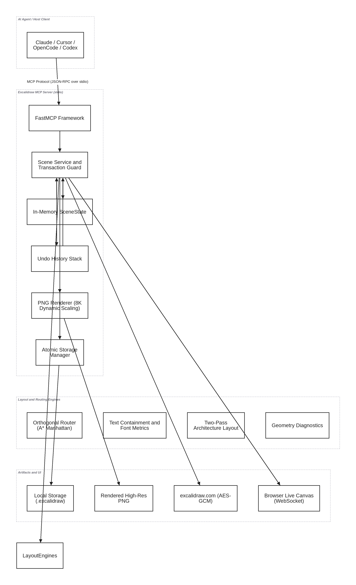
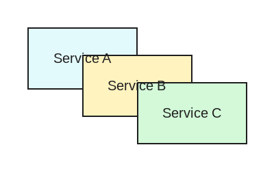
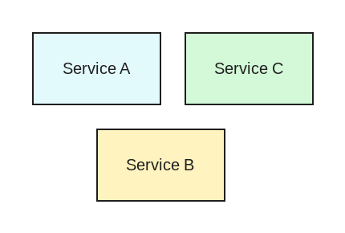

# Excalidraw MCP Server

<!-- TODO: mcp-name marker (server.json not found in repository) -->
[](https://www.python.org/)
[](https://pypi.org/project/exca-mcp/)
[](https://github.com/jlowin/fastmcp)
[](https://github.com/Dharshan2208/excalidraw-mcp/actions/workflows/ci.yml)
[](https://github.com/Dharshan2208/excalidraw-mcp/blob/main/LICENSE)
[](https://hatch.pypa.io/)

Excalidraw MCP is a backend oriented Model Context Protocol (MCP) server that enables AI agents to create, inspect, edit, diagnose, and export native [Excalidraw](https://excalidraw.com) diagrams over standard `stdio`.

Unlike browser automation wrappers, Excalidraw MCP operates directly on scene graphs and element trees in memory. AI coding agents can construct complex architectures, generate flowcharts from Mermaid syntax, inspect element hierarchies, and apply deterministic layout repairs without requiring a running web browser or graphical interface.

Diagrams are serialized in native Excalidraw Schema v2 format, ensuring immediate compatibility with excalidraw.com, standard Excalidraw desktop extensions, and headless image export pipelines.

---

## Demo


*This diagram was generated with Excalidraw MCP itself. Editable source: [docs/architecture.excalidraw](https://github.com/Dharshan2208/excalidraw-mcp/blob/main/docs/architecture.excalidraw).*

<details>
<summary>View agent generation workflow and tool calls</summary>

```python
# 1. Create architectural tier frames
f1 = add_frame(name="Tier 1 — Clients & Host Environments", x=100, y=100, w=1560, h=140)
f2 = add_frame(name="Tier 2 — Protocol Gateways & Security Edge", x=100, y=280, w=1560, h=150)
f3 = add_frame(name="Tier 3 — Application Core & Transaction Orchestrator", x=100, y=470, w=1560, h=160)
f4 = add_frame(name="Tier 4 — Layout, Routing & Geometry Subsystems", x=100, y=670, w=1560, h=160)
f5 = add_frame(name="Tier 5 — Rendering, Export & Cloud Integration", x=100, y=870, w=1560, h=160)
f6 = add_frame(name="Tier 6 — Persistence & File System Layer", x=100, y=1070, w=1560, h=160)

# 2. Add component boxes within tier frames
c1 = create_shape(type="rectangle", x=140, y=130, w=320, h=80, label="AI Coding IDEs & Agents\nClaude Desktop • Cursor • Zed", frame_id=f1["frame_id"], backgroundColor="#e3fafc")
c2 = create_shape(type="rectangle", x=540, y=130, w=320, h=80, label="Agent CLI & Automation Runners\nCodex CLI • FastMCP Inspector", frame_id=f1["frame_id"], backgroundColor="#e3fafc")
s1 = create_shape(type="rectangle", x=140, y=310, w=380, h=90, label="FastMCP Protocol Server (stdio)\nJSON-RPC 2.0 Transport • Schema Validation", frame_id=f2["frame_id"], backgroundColor="#fff3bf")
s2 = create_shape(type="rectangle", x=580, y=310, w=360, h=90, label="Security & Origin Firewall Guard\nEXCALIDRAW_LIVE_TOKEN • CSWSH Origin Guard", frame_id=f2["frame_id"], backgroundColor="#fff3bf")

# 3. Connect components with labeled connectors
create_connector(source_id=c1["rectangle_id"], target_id=s1["rectangle_id"], label="stdio JSON-RPC", elbowed=True)
create_connector(source_id=c2["rectangle_id"], target_id=s1["rectangle_id"], label="stdio JSON-RPC", elbowed=True)
create_connector(source_id=s1["rectangle_id"], target_id=s2["rectangle_id"], label="Validation Pipeline", elbowed=True)

# 4. Run automated layout repair and export
auto_fix_layout(dry_run=False)
export_png(name="architecture", directory="docs", scale=2.0)
scene_storage(action="save", name="architecture")
```
</details>

### Automated Layout Repair Preview

Excalidraw MCP includes an automated layout repair engine (`auto_fix_layout`) that detects and repairs overlaps, text clipping, and crowded nodes:

| Before Auto-Fix (Overlapping Nodes) | After Auto-Fix (Repaired Layout) |
|---|---|
|  |  |

---

## Key Features

### A. Intelligent Diagram Generation
- **Native Schema v2 Serialization**: Generates valid Excalidraw JSON documents that open directly in Excalidraw without conversion.
- **Unified Generator (`generate_diagram`)**: Parses Mermaid flowchart/graph syntax (`TD`, `TB`, `LR`, `RL`, `BT`), rapid shorthand architecture prompts (`box`, `circle`, `diamond`, `db`), or structured Sugiyama node/edge graphs with automatic frame clustering.
- **Semantic Arrow Binding (`create_connector`)**: Creates smart directional connectors with start/end element bindings that stay connected when shapes move or resize, featuring obstacle avoidance and cardinal-face docking.

### B. Advanced Layout and Geometry
- **Obstacle-Aware Orthogonal Routing**: Calculates Manhattan paths around intermediate bounding boxes with 15 px obstacle clearance corridors.
- **Cardinal-Face Port Attachment**: Dynamically calculates dock points and surface normal vectors on the top, bottom, left, and right faces of rectangles, ellipses, and diamonds.
- **Multi-Edge Parallel Lane Assignment**: Displaces parallel connectors between the same shapes into distinct lanes (24 px spacing) to eliminate line overlaps.
- **Collision-Free Label Placement**: Positions connector labels along unobstructed route segments away from intersecting nodes.
- **Font-Aware Text Metrics**: Accurately measures text dimensions and character envelopes using FreeType and Pillow.
- **Font Support**: Supports Excalidraw standard font families: Excalifont (handwriting), sans-serif (Helvetica), monospace (Cascadia), and Comic Shanns. Discoverable via MCP resource `excalidraw://fonts`.
- **Inscribed Polygon Boundary Containment**: Enforces geometric containment math for labels inside rhombuses and ellipses.
- **Two-Pass Architecture Layout**: Measures all components in pass 1, then computes wrapped rows and frame boundaries in pass 2.

### C. Automated Diagnostics and Layout Repair
- **Geometric Defect Detection**: Detects bounding box collisions, text clipping, frame containment escapes, and crowded node gaps.
- **Automated Repair Engine (`auto_fix_layout`)**: Executes targeted geometry repairs across five deterministic phases:
  1. Container text clipping expansion outward from center.
  2. Minimal-displacement de-collision with grouping preservation.
  3. Frame boundary containment padding expansion.
  4. Obstacle-aware connector rerouting.
  5. Component spacing adjustments for crowded nodes.
- **Simulation Mode (`dry_run=True`)**: Generates an actionable repair plan and defect inventory without mutating the active canvas.
- **Transactional Rollback Safety**: Reverts mutations automatically if a repair phase increases collisions or degrades layout geometry.

### D. Rendering and Export
- **Dynamic Canvas Dimensioning**: Computes exact bounding hulls for active scenes with configurable padding.
- **High-Resolution PNG Export (`export_png`)**: Headless Pillow rasterization supporting dynamic export dimensions up to 8192 px.
- **Inline Agent Previews (`preview`)**: Generates base64-encoded image previews directly into LLM turns with aspect-ratio dimension capping (`max_dimension=1568`) and selectable output formats (`format="png" | "jpeg"`).
- **Native Document Persistence (`scene_storage`)**: Atomically saves, loads, lists, exports, and imports complete `.excalidraw` JSON files.
- **Headless Rasterization**: Full raster export and preview rendering without browser runtimes, Node.js, or external CLI dependencies.

### E. Agent and Tooling Optimization
- **Two-Tier Toolset Profiles**: Supports `core` (12 tools) and `full` (20 tools) profiles via the `EXCALIDRAW_TOOLSET` environment variable.
- **Halved Schema Context Overhead**: The default `core` profile drops from 9,472 to 5,048 compact tokens per turn (46.7% reduction); `full` drops from 16,010 to 7,937 tokens (50.4% reduction). Wire duplication is completely eliminated.
- **Atomic Authoring in Core (`batch_mutate`)**: Included in the default profile for single-turn multi-element creation, styling, and repair.
- **Zero-Token Discovery via MCP Resources**: MCP resources `excalidraw://fonts`, `excalidraw://guide/{topic}`, and `excalidraw://capabilities` provide fonts, design rules, and tool catalogs without consuming LLM turn context.
- **Six Bundled Agent Skills**: Packaged prompt and pattern guides teach agents optimal color palettes, spacing rules, and diagram workflows.
- **Fast Onboarding**: Direct execution via `uvx exca-mcp` and root-level `mcp.json` support.

### F. Interactive Canvas and Element Management
- **Background Live Canvas Server (`live_server`)**: Optional Starlette and WebSocket engine serving an interactive web visualizer.
- **Real-Time Browser Sync**: Live bidirectional WebSocket updates synchronize agent tool mutations to browser tabs in real time.
- **Element State Controls (`manage_element_state`)**: Unified tool for locking elements against accidental edits, logical grouping/ungrouping, and spatial element duplication.
- **Camera Viewport Controls (`set_viewport`)**: Programmatically sets canvas coordinates, zoom scale, background color, or auto-frames specific elements.
- **Syntax-Highlighted Code Blocks**: Renders monospace code blocks with window chrome, line numbers, and theme options directly via `batch_mutate`.

### G. Reliability and Security
- **Atomic File Operations**: Persisted scenes and exported images use temporary files and atomic rename operations.
- **Process-Local Undo Stack (`undo`)**: Reverts mutations across a bounded history stack (`EXCALIDRAW_HISTORY_LIMIT` snapshots).
- **Client-Side Encrypted Sharing (`export_to_excalidraw_url`)**: Generates shareable excalidraw.com links using client-side AES-GCM encryption.
- **Filesystem Write Sandboxing**: Confinements enforce writes strictly within configured scene and export directories.
- **Live Server Token Authentication**: Protects live canvas mutations via `EXCALIDRAW_LIVE_TOKEN` shared secrets.
- **CSWSH Origin Validation**: Restricts live server WebSocket connections to localhost, 127.0.0.1, and excalidraw.com.

For full feature documentation, see [docs/features.md](docs/features.md).

---

## Architecture


*This system architecture diagram was generated with Excalidraw MCP itself, serving as both a functional capability demo and the system architecture diagram. Editable source: [docs/architecture.excalidraw](https://github.com/Dharshan2208/excalidraw-mcp/blob/main/docs/architecture.excalidraw).*

The server architecture consists of four primary internal subsystems:

1. **Protocol Layer (`FastMCP`)**: Exposes strictly typed tools, resources, and task prompts over standard MCP `stdio`. Exposes either the 12-tool `core` or 20-tool `full` profile based on `EXCALIDRAW_TOOLSET`.
2. **State & Transaction Engine (`SceneService`)**: Maintains active elements, frame parent-child hierarchies, and a bounded undo stack (`EXCALIDRAW_HISTORY_LIMIT`) in memory with monotonic revision counters.
3. **Geometric Computation Subsystems**:
   - [`routing.py`](excalidraw_mcp/routing.py): Computes cardinal-face ports, 15 px obstacle avoidance corridors, and 24 px parallel multi-lane connector paths.
   - [`text_padding.py`](excalidraw_mcp/text_padding.py) & [`fonts.py`](excalidraw_mcp/fonts.py): Font metric measurement, word wrapping, and inscribed rhombus/ellipse text containment.
   - [`auto_fix.py`](excalidraw_mcp/auto_fix.py): Five-phase topological layout diagnostic and repair engine with automatic regression rollback.
4. **Rendering and Persistence Layer**:
   - [`renderer.py`](excalidraw_mcp/renderer.py): Headless Pillow rasterization generating PNG exports up to 8192 px and inline base64 image previews.
   - [`scene.py`](excalidraw_mcp/scene.py): Confined, atomic scene persistence in native Excalidraw Schema v2 format.
   - [`sharing.py`](excalidraw_mcp/sharing.py): Client-side AES-GCM encrypted URL generation for direct sharing to excalidraw.com.
   - [`live_server.py`](excalidraw_mcp/live_server.py): Background Starlette/Uvicorn server providing real-time WebSocket synchronization to an interactive browser canvas.

For deep subsystem implementation details, see [docs/ARCHITECTURE.md](docs/ARCHITECTURE.md).

---

## Installation

### Recommended: `uvx` (Zero Install)

Run the published PyPI package instantly in an ephemeral, isolated environment using [`uvx`](https://docs.astral.sh/uv/):

```bash
uvx exca-mcp
```

### Alternative: `pip`

Install into a Python 3.10+ virtual environment:

```bash
pip install exca-mcp
python -m excalidraw_mcp
```

### Alternative: Docker

Build and run the container locally via standard input/output:

```bash
# Build the Docker container locally
docker build -t exca-mcp .

# Run the server via standard I/O (interactive mode -i is required for MCP stdio)
docker run -i --rm exca-mcp
```

---

## Client Configuration

Configure Excalidraw MCP in your AI development environment:

### Claude Desktop

Add to `claude_desktop_config.json`:

```json
{
  "mcpServers": {
    "excalidraw": {
      "command": "uvx",
      "args": ["exca-mcp"]
    }
  }
}
```

### Cursor

Add to `.cursor/mcp.json` or Global MCP Settings:

```json
{
  "mcpServers": {
    "excalidraw": {
      "command": "uvx",
      "args": ["exca-mcp"]
    }
  }
}
```

### Zed

Add to `~/.config/zed/settings.json`:

```json
{
  "context_servers": {
    "excalidraw": {
      "command": {
        "path": "uvx",
        "args": ["exca-mcp"]
      }
    }
  }
}
```

### OpenCode

Add to `opencode.json`:

```json
{
  "mcp": {
    "excalidraw": {
      "type": "local",
      "command": ["uvx", "exca-mcp"]
    }
  }
}
```

---

## Agent Skills

Excalidraw MCP packages six specialized agent skills that guide AI coding models on color harmony, spatial hierarchy, and diagram construction:

| Skill | Description | Key Topics |
|---|---|---|
| `diagram-planning` | Upfront planning and entry-tool decision tree. | Diagram classification, audience targeting, layout tiering, entry tool selection. |
| `architecture-diagrams` | Cloud, distributed systems, and backend design. | Multi-tier frames, ingress/egress boundaries, side columns, explicit protocol bindings. |
| `flowcharts-and-processes` | Process flows, logic pipelines, and state machines. | Single start/terminals, decision diamonds, labeled branches, perimeter retry loops. |
| `human-style-and-polish` | Excalidraw hand-drawn aesthetics and polish. | 60-30-10 palette rule, stroke weights, typography scale, geometric clearances. |
| `verify-and-editable-handoff` | Defect verification and dual-format delivery. | `auto_fix_layout` diagnostics, PNG visual review, human editability checks. |
| `excalidraw-workflow` | End-to-end diagram construction lifecycle. | Initialization, multi-tier layout, routing, verification, and persistence. |

### Installing Skills into Your Project

Use the bundled CLI installer to install packaged skills into your project workspace:

```bash
# List all packaged skills and reference guides
uvx exca-mcp install-skills --list

# Install skills into your project-local .skills directory
uvx exca-mcp install-skills --target .skills
```

Skills are also directly accessible to MCP clients via the `exca-mcp://skills/index` and `exca-mcp://skills/{name}` resources. See [docs/skills.md](docs/skills.md).

---

## Toolset Overview

The server provides two toolset profiles controlled by the `EXCALIDRAW_TOOLSET` environment variable:

| Profile | Tools | Description |
|---|---:|---|
| `core` | 12 | Default toolset covering creation (`create_shape`, `create_connector`, `add_text`, `add_frame`), manipulation (`update_element`, `delete`, `clear`, `undo`), atomic transactions (`batch_mutate`), inspection (`inspect_scene`), repair (`auto_fix_layout`), and visual inspection (`preview`). |
| `full` | 20 | Complete toolset adding persistent file storage (`scene_storage`), disk rasterization (`export_png`), advanced generators (`generate_diagram`), element locking/grouping (`manage_element_state`), camera viewport framing (`set_viewport`), background live server (`live_server`), cloud sharing (`export_to_excalidraw_url`), and design rules (`read_diagram_guide`). |

The default `core` toolset requires only **5,048 compact tokens** (~46.7% reduction vs baseline), leaving significantly more context window available for agent reasoning.

To enable the complete 20-tool set:

```bash
export EXCALIDRAW_TOOLSET=full
```

For the complete reference of all 20 tools, safety annotations, and MCP resources, see [docs/tools.md](docs/tools.md). For migrating from v0.2.x, see [docs/migration_v030.md](docs/migration_v030.md).

---

## MCP Resources

In addition to tools, Excalidraw MCP registers static and parameterized resources that clients can read without consuming tool call turns:

- **`excalidraw://fonts`**: Returns available system fonts, Excalifont paths, and default semantic categories (`application/json`).
- **`excalidraw://guide/{topic}`**: Returns diagram design rules for `layout`, `colors`, `typography`, `grouping`, `arrows`, and `spacing` (`text/markdown`).
- **`excalidraw://capabilities`**: Machine-readable server metadata, active profile (`core` vs `full`), and configuration paths (`application/json`).
- **`excalidraw://scenes/{name}.excalidraw`**: Directly reads a saved `.excalidraw` JSON file from disk without modifying the active working scene.
- **`exca-mcp://skills/index`**: Discoverable index of bundled agent diagramming skills.

---

## Common Workflows

### 1. Generating Flowcharts from Mermaid Syntax
Convert existing Mermaid flowchart syntax into native Excalidraw elements (available in `full` profile):

```python
generate_diagram(
    generator="mermaid",
    mermaid_code="""
    graph TD
        Client[Web Client] --> Gateway[API Gateway]
        Gateway --> Auth[Auth Service]
        Gateway --> Orders[Order Service]
        Orders --> DB[(PostgreSQL)]
    """,
    direction="TD",
    elbowed=True
)
```

### 2. Sketching Systems Using Architecture Shorthand
Rapidly sketch multi-component system architectures (available in `full` profile):

```python
generate_diagram(
    generator="architecture",
    prompt="box: Client Web App, box: API Gateway, circle: Redis Cache, db: Postgres Database",
    wrap_threshold=3
)
```

### 3. Single-Turn Construction via `batch_mutate` (in Core)
Construct complex connected diagrams atomically in a single roundtrip with dynamic `$ref` references:

```python
batch_mutate(operations=[
    {"action": "create_shape", "type": "rectangle", "client_id": "svc_a", "x": 100, "y": 100, "w": 140, "h": 70, "label": "Service A"},
    {"action": "create_shape", "type": "rectangle", "client_id": "svc_b", "x": 340, "y": 100, "w": 140, "h": 70, "label": "Service B"},
    {"action": "create_connector", "source_id": "$svc_a", "target_id": "$svc_b", "label": "gRPC", "elbowed": True},
    {"action": "auto_fix_layout", "repair_scope": "all"}
])
```

### 4. Querying Scene State with `inspect_scene`
Inspect elements, summaries, or search for components through a single unified endpoint:

```python
# Semantic summary
summary = inspect_scene(mode="summary")

# Search for components
matches = inspect_scene(mode="find", query="Gateway", type="rectangle")
```

### 5. Diagnosing and Applying Layout Repairs
Preview layout defects (overlaps, text clipping, and crowding) or apply automated topological repairs:

```python
# Dry-run inspection
report = auto_fix_layout(dry_run=True, repair_scope="all")

# Apply repairs atomically with rollback protection
result = auto_fix_layout(dry_run=False, aggressiveness="balanced", min_gap=30.0)
```

### 6. Visual Inspection with Preview
Generate an inline preview formatted for LLM vision models:

```python
# Preview capped at 1568px (Claude optimal vision envelope) as PNG or JPEG
preview(max_dimension=1568, format="png")
```

For full details on the layout repair engine, see [docs/auto-fix-layout.md](docs/auto-fix-layout.md).

---

## Configuration

Configure server behavior using environment variables:

| Variable | Default | Valid Range / Format | Description |
|---|---|---|---|
| `EXCALIDRAW_TOOLSET` | `core` | `core`, `full` | Active toolset exposure profile. |
| `EXCALIDRAW_SCENE_DIR` | OS user data dir | Absolute path | Directory where `.excalidraw` scenes are saved. |
| `EXCALIDRAW_EXPORT_DIR` | `EXCALIDRAW_SCENE_DIR/exports` | Absolute path | Target directory for PNG image exports. |
| `EXCALIDRAW_HISTORY_LIMIT` | `20` | `1` – `100` | Maximum undo snapshots retained in memory. |
| `EXCALIDRAW_MAX_HISTORY_BYTES` | `104857600` (100MB) | `1024` – `524288000` | Memory budget for the serialized undo stack. |
| `EXCALIDRAW_MAX_SCENE_BYTES` | `26214400` (25MB) | `1024` – `104857600` | Maximum file size accepted when loading scenes. |
| `EXCALIDRAW_MAX_EXPORT_BYTES` | `26214400` (25MB) | `1024` – `104857600` | Maximum payload size for scene export operations. |
| `EXCALIDRAW_MAX_ELEMENTS` | `10000` | `1` – `100000` | Maximum elements allowed per scene. |
| `EXCALIDRAW_LIVE_PORT` | `8080` | `1024` – `65535` | Port for the live canvas browser server. |
| `EXCALIDRAW_LIVE_TOKEN` | *Unset* | String | Shared secret required for mutating live canvas requests. |
| `EXCALIDRAW_ALLOW_REMOTE` | *Unset* | `1`, `true` | Permits live canvas binding to non-loopback interfaces. |
| `EXCALIDRAW_FONT_DIR` | *Unset* | Absolute path | Custom directory for TrueType/OpenType font discovery. |

---

## Live Canvas Server

The server includes an optional live canvas server (`live_server`, available in the `full` toolset) that synchronizes scene mutations to an interactive browser window in real time:

1. Enable the full toolset: `export EXCALIDRAW_TOOLSET=full`.
2. Agent invokes `live_server(action="start", host="127.0.0.1", port=8080)`.
3. Open `http://localhost:8080` in a browser.
4. Diagram mutations performed by the agent appear in real time over WebSockets.

See [docs/security.md](docs/security.md) for live server authentication and network guards.

---

## Security

Excalidraw MCP implements strict boundaries to protect local environments:

- **Filesystem Write Sandboxing**: `scene_storage` is confined strictly to `EXCALIDRAW_SCENE_DIR`. `export_png` writes only to allowed roots (`export_directory`, `scene_directory`, `Path.cwd()`, or `tempfile.gettempdir()`). Path traversal (`..`) and symlink escapes are rejected.
- **Skill Installer Security**: `exca-mcp install-skills` rejects installation to the system root (`/`) and blocks symlink traversal.
- **Token Authentication (`EXCALIDRAW_LIVE_TOKEN`)**: When configured, live canvas mutations via REST (`POST /api/scene`) and WebSocket connections (`/ws`) require token verification.
- **CSWSH Origin Defense**: The WebSocket live server rejects connections originating from untrusted web origins.
- **Interface Guard (`EXCALIDRAW_ALLOW_REMOTE`)**: Binding the live server to `0.0.0.0` or external interfaces is blocked unless explicitly enabled.

For security guidelines or vulnerability reporting, see [SECURITY.md](SECURITY.md) and [docs/security.md](docs/security.md).

---

## Limitations

- **Mermaid Syntax Scope**: Mermaid syntax in `generate_diagram(generator="mermaid", ...)` supports `flowchart` and `graph` syntax (including subgraphs, common node shapes, and edge labels). Other Mermaid diagrams (sequence, class, state, ER, Gantt) are not supported.
- **Process-Local Memory**: Active scenes reside in server memory. If the MCP server process restarts, unsaved scenes reset; call `scene_storage(action="save", name=...)` to persist scenes to disk.
- **Export Formats**: Headless export produces native `.excalidraw` JSON and PNG images. Direct SVG export without a browser runtime is not currently supported.
- **Live Canvas Toolset**: Live canvas sync (`live_server`) requires `EXCALIDRAW_TOOLSET=full`.

---

## Troubleshooting

### Tool Not Found Errors (`generate_diagram`, `scene_storage`, `live_server`)
- **Cause**: The server defaults to the `core` profile (12 tools) for token efficiency.
- **Solution**: Set `EXCALIDRAW_TOOLSET=full` in your MCP client environment configuration.

### PNG Export Validation Errors
- **Cause**: Target export directory is outside permitted paths.
- **Solution**: Export to `./exports`, `Path.cwd()`, or configure `EXCALIDRAW_EXPORT_DIR` with an absolute path.

### Live Canvas Remote Connection Denied
- **Cause**: Server blocked binding to `0.0.0.0` for security.
- **Solution**: Use `127.0.0.1` (default) or set `EXCALIDRAW_ALLOW_REMOTE=1` if remote access is required.

---

## Development

```bash
# Clone the repository
git clone https://github.com/Dharshan2208/excalidraw-mcp.git
cd excalidraw-mcp

# Synchronize dependencies with uv
uv sync --all-extras

# Run the full unit test suite
uv run --locked python -B -m unittest discover -s tests -v

# Verify source compilation
python -m compileall excalidraw_mcp tests

# Validate package distribution
uv build
uvx twine check dist/*
```

See [CONTRIBUTING.md](CONTRIBUTING.md) for full development and contribution guidelines.

---

## Documentation Index

- [docs/tools.md](docs/tools.md): Complete reference of all 20 tools, signatures, safety hints, and MCP resources.
- [docs/migration_v030.md](docs/migration_v030.md): Migration guide mapping all 48 baseline tools to v0.3.0 equivalents.
- [docs/features.md](docs/features.md): Comprehensive capability and feature breakdown.
- [docs/auto-fix-layout.md](docs/auto-fix-layout.md): Five-phase layout repair engine, parameters, and rollback guarantees.
- [docs/skills.md](docs/skills.md): Agent skills catalog, reference guides, and installer instructions.
- [docs/security.md](docs/security.md): Security guide, write sandboxing, and live server protections.
- [docs/ARCHITECTURE.md](docs/ARCHITECTURE.md): Technical deep dive into subsystem architecture and geometry algorithms.
- [CHANGELOG.md](CHANGELOG.md): Project release history and version migration notes.
- [SECURITY.md](SECURITY.md): Security policy and vulnerability disclosure procedures.

---

## License

This project is licensed under the [MIT License](https://github.com/Dharshan2208/excalidraw-mcp/blob/main/LICENSE).
